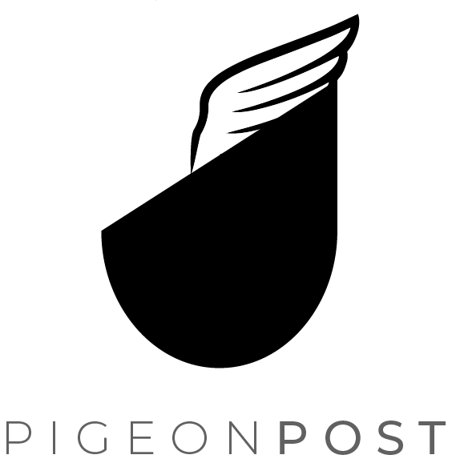
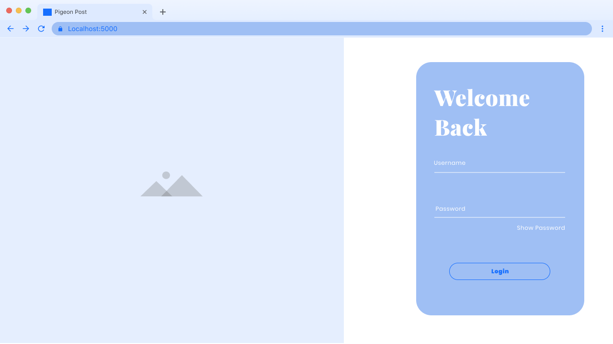
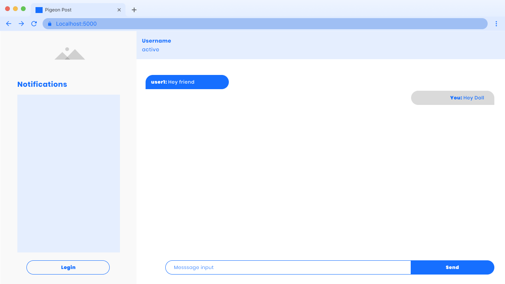
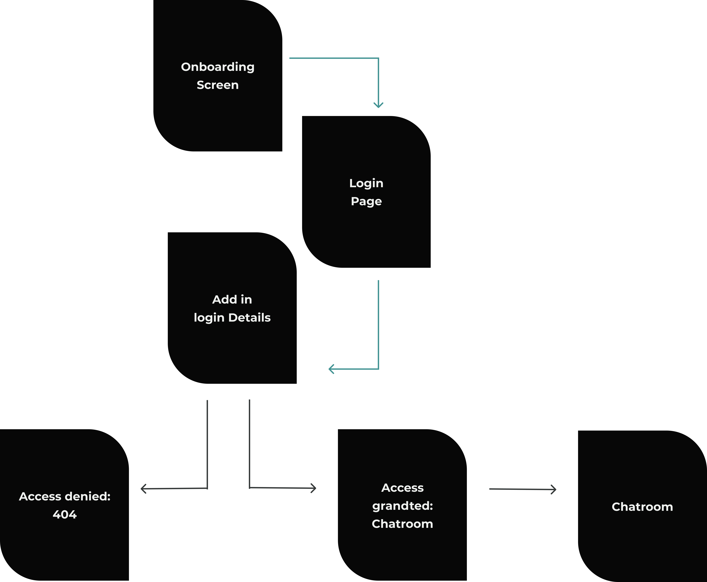

<!-- PROJECT LOGO -->
<br />
<p align="center">
  <a href=" ">
    
  </a>

  <h3 align="center">Pigeon Post</h3>

  <p align="center">
    A web based chat room application, developed using Node.js, Socket.io and express. Which enables users to login in to join chatrooms, where they can send and receive messages from other connected users
    <br />
  </p>
</p>


<!-- TABLE OF CONTENTS -->
<details open="open">
  <summary><h2 style="display: inline-block">Table of Contents</h2></summary>
  <ol>
    <li>
      <a href="#about-the-project">About Project</a>
      <ul>
        <li><a href="#built-with">Built With</a></li>
        <li><a href="#features">Features</a></li>
      </ul>
    </li>
    <li>
      <a href="#getting-started">Getting Started</a>
      <ul>
        <li><a href="#prerequisites">Prerequisites</a></li>
        <li><a href="#installation">How to Install</a></li>
      </ul>
    </li>
    <li><a href="#concept-ideation">Concept Ideation</a>
      <ul>
        <li><a href="#wireframes">Wireframes</a></li>
        <li><a href="#task-flow">Task Flow</a></li>
      </ul>
    </li>
    <li><a href="#video-demonstration">Video Demonstration</a>
      <ul>
        <li><a href="#video-demo">Video Demo</a></li>
      </ul>
    </li>
    <li><a href="#contributing">Contributing</a></li>
    <li><a href="#license">License</a></li>
    <li><a href="#contact">Contact</a></li>
    <li><a href="#acknowledgements">Acknowledgements</a></li>
  </ol>
</details>


<!-- ABOUT THE PROJECT -->
## About The Project

Pigeon Post, is a web based chat room application, developed using Node.js, Socket.io and express. Which enables users to login in to join chatrooms, where they can send and receive messages from other connected users.


### Built With

* [Node.js]()
* [Socket.io]()
* [JQuery]()
* [Javascript]()

### Features

- Sending/ Receiving Messages from connected users
- Seeing users in chatroom
- Receiveng all 'history messages' upon arrival.


<!-- GETTING STARTED -->
## Getting Started


### Prerequisites

Assuming that you already have [Node.js](https://nodejs.org/en/download/) installed, then we will npm install

* npm
  ```sh
  npm install
  ```

There after we will go on to creating a `package.json` file:
* npm
  ```sh
  npm init —-yes
  ```

### Installation

<b>Node Static</b><br>
<br>
We have installed `node static` in order for it to serve static HTML files to us. By using npm install, this will make sure that is easily added to our dependancies located in our  package. json file.

   ```sh
  npm install --save node-static
   ```

Once this has been done we will create two .js files. 
- server.js
- client.js

<br>

<b>Integrating Socket.IO</b><br>
<br>
Then we will move on to installing socket.io

   ```sh
  npm install socket.io 
   ```

Then install socket.io-client for our `client.js` file.

   ```sh
  npm install socket.io-client
   ```

<b>Adding our Templates Module</b><br>
<br>
Lastly we will also install the templates strings module
 ```sh
  npm install es6-template-strings
   ```


## Concept Ideation

Use this space to show useful examples of how a project can be used. Additional screenshots, code examples and demos work well in this space. You may also link to more resources.

_For more examples, please refer to the [Documentation](https://example.com)_

### Wireframes





### Task Flow




## Video Demonstration

### Video Demo


<!-- LICENSE -->
## License

Distributed under the MIT License. See `LICENSE` for more information.


<!-- CONTACT -->
## Contact

Karabo

Project Link: [ https://github.com/KaraboMthelezulu/Node.js-Chatroom.git ]( https://github.com/KaraboMthelezulu/Node.js-Chatroom.git )


<!-- ACKNOWLEDGEMENTS -->
## Acknowledgements

* [Socket.io support](https://socket.io/get-started/chat/#The-web-framework)
* [Github socket.io-website](https://github.com/socketio/socket.io-website/blob/master/source/get-started/chat.md)


